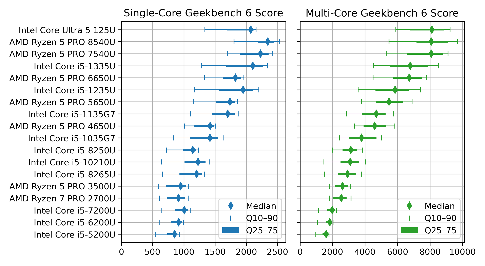
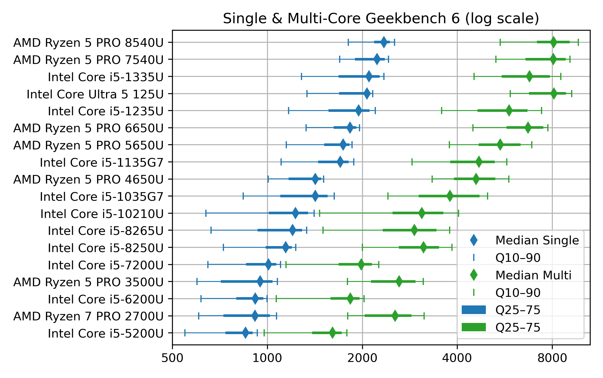
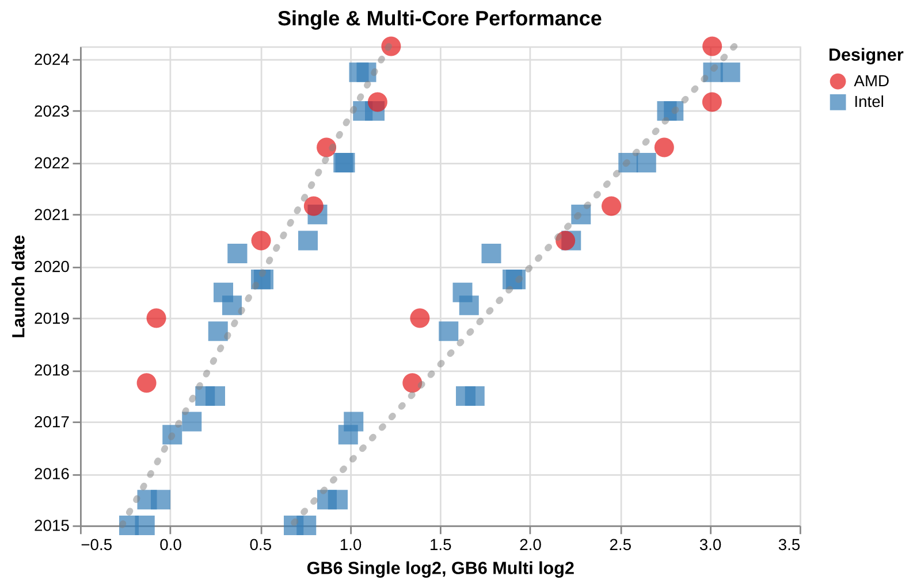

# Plots

## CPU performance plots

remark: the "red plots" needs to be updated

|                          | Sorted by Single-Core performance                            | Sorted by Multi-Core performance                             |
| ------------------------ | ------------------------------------------------------------ | ------------------------------------------------------------ |
| Short list, linear scale |  |  |
| Short list, log scale    |  |  |
| Long list, linear scale  |  |  |
| Long list, log scale     |  |  |

and the GIF animation which switch between Single- and Multi-Core performance sort:

- [CPUs_GB6_stats_short_sort-anim.gif](CPUs_GB6_stats_short_sort-anim.gif)
- [CPUs_GB6_logstats_short_sort-anim.gif](CPUs_GB6_logstats_short_sort-anim.gif)

## CPU along time

Plots made with [Vega-Altair](https://altair-viz.github.io/), so that the display of interactive versions need a web page which loads the JSON files. There are also static image exports.

Linear scale (JSON specification: [CPUs_bydate_linear_withreg.json](CPUs_bydate_linear_withreg.json))

 

Log scale, superimposed on the same chart (JSON specification  [CPUs_bydate_log_withreg.json](CPUs_bydate_log_withreg.json))

