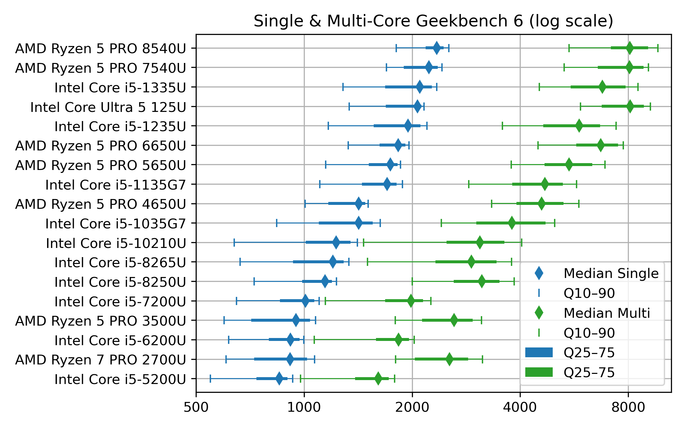
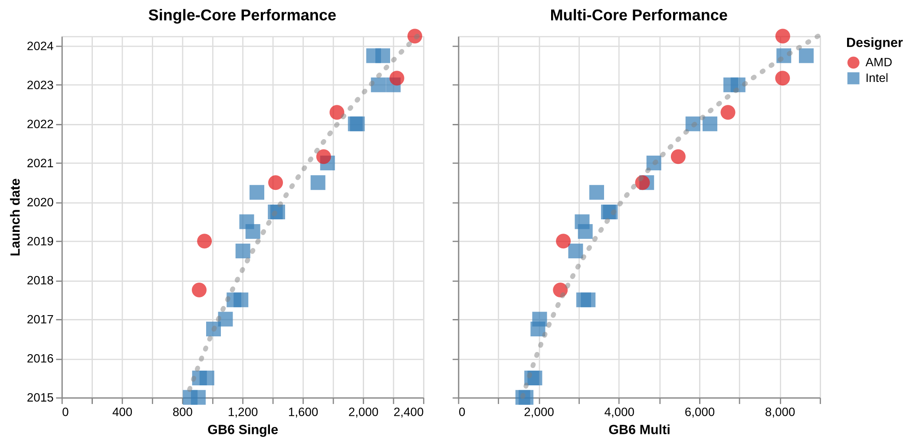
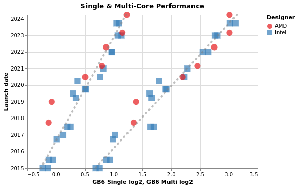

# A decade of office notebook processors

This post is meant to help people in search of a refurbished notebook. Indeed, it’s easy to get lost in the processors references (*“how does an Intel Core i5-8250U compares to an i5-10210U?”* Spoiler: they are almost the same!). It is the outcome of me researching whether it is worth replacing my Lenovo [Thinkpad T470](https://www.notebookcheck.net/Lenovo-ThinkPad-T470-Core-i5-Full-HD-Notebook-Review.198130.0.html) notebook, a 2017 model bought 2nd hand in 2020. While the conclusion is that I’ll probably wait a bit more, this was a nice data research about the evolution of the computing power of office notebooks over the last decade.

In this post I focus on key results while the full dataset and associated Python code is available in the GitHub repository https://github.com/pierre-haessig/notebook-cpu-performance/. Also, there is a [CPUs table](https://baserow.io/public/grid/wLq_Mhbx1y8jm7z82Y1GuqrCpNtOCkBqdHHgYqoNP0M), with characteristics and performance scores hosted on [Baserow](https://baserow.io/). Testing this so-called “no-code” cloud database was an additional excuse for this project... While I don’t want to comment my experience here, I’ll just say I found it a neat alternative to spreadsheets for doing database-style work (e.g. creating links between tables).

### Dataset description

**About the score**: I’ve extracted computing performance scores from the [Geekbench 6](https://www.geekbench.com/) data browser https://browser.geekbench.com/ which conveniently make their database public *(in exchange of Geekbench users automatically contributing to the database for free)*. This test provides two scores:

- **Single-Core** score is useful to assess the  execution speed of one application (webmail, text editor, spreadsheet...)
- **Multi-Core** score is geared towards multitasking (or some computations which can exploit all processor cores like video encoding, I believe).

Geekbench explains that these scores are **proportional to the processing speed**, so a score which is twice as large means a processor that is twice as fast, that is a computing task completed in half the time, if I got it right.

**About the processors selection**: I’ve extracted the scores for CPUs found in **typical refurbished office notebooks**, that is **midrange** & **low power** CPUs, aka *Intel Core i5* processors, from the so-called [U series](https://www.makeuseof.com/intel-u-vs-p-vs-h-laptop-cpus/), but also corresponding *AMD Ryzen 5*. The earliest model is the Intel Core i5-5200U launched in 2015, while the most recent is the Intel Core Ultra 125U/135U from late 2023 (there wasn’t enough data for the 2024 Intel Core Ultra 2xx models). Notice that there are no refurbished notebooks of 2023 yet on the market, so there is some amount of guessing on what will be the "typical office notebook CPUs" of 2023-2025.

### CPU performance charts

Enough speaking, here are two graphs of processor performance.

#### 1\) Ranked CPU performance

First a dot plot/boxplot chart showing  CPU performance, ranked by Single-Core performance (which is *close, but not quite*, the same as the Multi-Core rank):

The horizontal scale for the score is *logarithmic*, so that each vertical grid line means a difference by a factor 2. This allows superimposing Single-Core (blue) and Multi-Core (green) data.

The diamonds are the **median scores**, while the lines show the **variability**. Indeed, there is no unique value for each CPU, due to the many factors which can affect computing performance: temperature, power source (battery vs. AC adapter) and energy saving policy (max performance vs. max battery life). To account for this, I’ve collected about **1000 samples** for each CPU and summarized them by computing quantiles. The thick lines show the quantiles 25%–75% (also called interquartile range, which contains half the samples) while the thin line ended by mustaches shows the quantiles 10%–90% (the most extreme deciles which contain 80% of the samples).

Notice that to avoid data overcrowding, this the “short” version of the chart where I picked one CPU model per generation, while there are typically two (like i5-1135 and i5-1145, with very close performance). The full chart variant (twice as long) can be found in the [chart repository](https://github.com/pierre-haessig/notebook-cpu-performance/tree/main/Geekbench%206%20plots), along with the variants sorted by Multi-Core score.

#### 2\) CPU performance over time, with trend

The  second chart shows the **evolution of CPU performance over time**. Only the median score is shown here, to avoid overcrowding the graph, but with all the CPU models of the dataset. This graph is **interactive** (perhaps a mouse is required, though): hovering each point reveals the processor name and details like the number of cores.

The dot color and shape discriminate the CPU designer: Intel vs. AMD (the classical term “manufacturer” is not appropriate for AMD, neither for the latest Intel products). The gray dotted line shows the exponential trend, that is a constant-rate growth trends, in the spirit of Moore’s law (doubling every 2 years), albeit with a *much smaller rate*, see values below.

This second plot was done with [Vega-Altair](https://altair-viz.github.io/) which is very nice for data exploration and interactivity. However, it is perhaps a bit less customizable than my “old & reliable” plotting companion, [Matplotlib](https://matplotlib.org), used for the first chart. In particular, I didn’t manage to replicate to the nice log2 scale, created by manually setting the ticks position and label (see [Retrieve_geekbench.ipynb](https://github.com/pierre-haessig/notebook-cpu-performance/blob/main/Retrieve_geekbench.ipynb) notebook, “Log2 scale variant”), but could be achieved more cleanly with Matplotlib’s [tick formatter](https://matplotlib.org/stable/gallery/ticks/tick-formatters.html). So here is the log2 variant of the performance over time chart, albeit with the raw log2 scores. With this scale, the exponential trend becomes a straight line.

How to read these raw log2 scores: values [0, 1, 2, 3] correspond to [1000, 2000, 4000, 8000], while the general formula is <i>y</i> = 1000 × 2<i>x</i>. Also, because there are grid lines for half scores (0.5→1000×√2 ≈ 1414), scores which are different by factor 2 are here separated by two grid lines instead of just one in the first plot.

### Comments of CPU performance

What can be said from the charts above?

#### 1\) General trend

Sure, there has been *some* progress in CPU performance over the decade 😌

- *but* the progress is faster for Multi-Core than Single-Core performance. In detail,  the exponential trend fitting yields: 
- **Single-core** trend: +12% per year (±1%), or, said differently, a time to double the performance of about **6.25 years** (±10 months)
- **Multi-core** trend: +20%/y ±2%/y, or a time to double the performance of about **3.75 years** (±4 months)
- see [CPUs_plot.ipynb](https://github.com/pierre-haessig/notebook-cpu-performance/blob/main/CPUs_plot.ipynb) notebook for details

→ In both cases, the growth well slower than the 2 years (that is +41%/y) of [Moore’s law](https://en.wikipedia.org/wiki/Moore’s_law).

#### 2\) Effect of increased core count

There is a clear effect of diminishing returns within the general trend to add more CPU cores:

- From about 2010 until 2017 (ending with Intel 7th gen Core i5-7*00U), notebook CPUs shipped with 2 cores, with a Multi-Core score ending close to **twice** the Single-Core one (2000 vs 1000 for Intel Core i5-7300U)
- From 2018 to 2021, notebook CPUs had 4 cores, but with Multi-Core to Single-Core scores ratio between 2.5 and 3.0 (at least for median scores)
- Fast-forward to 2024, the most recent CPUS come with 6 (AMD) or even 10–12 cores (Intel, albeit with only 2 P[owerful] cores), and the Multi-Core score finally gets close to **4 times** the Single-Core one (8000 vs. 2000 for Core Ultra 125U).

#### 3\) Off the trend

The exponential fits gives a *false sense of a smooth progress* in performance, while the true evolution is a bit more stepwise, with some processors “lagging behind” and others “ahead of their time”:

- AMD CPUs before 2020 (Ryzen 7 PRO 2700U and Ryzen 5 PRO 3500U) are lagging behind their Intel counterpart, especially for Single-Core performance. Successors have closed the gap (notably with the Ryzen 5 PRO 5650U).
- From 2018 to 2020, Intel has kept releasing “re-re-refreshed” versions of its 2017 Kaby Lake (7th gen) architecture, so that the difference between the Intel Core i5-8250U (mid 2017), i5-8265U (mid 2018) and i5-10310U (early 2020) is pretty thin.
- Performance of Intel processors makes nice leaps with the 11th and 12th gen (Core i5 11\*5G7 and 12\*5U), but things get more mixed starting 2023 with the new branding of “Core Ultra” processors, which comes with more variants (V and U series in the 2nd gen). Time will tell how this evolves further.

#### 4\) About performance variability

Up to this point, I’ve only commented the median score, while deferring the discussion about performance variability shown on the first plot.

- First things first: the **performance variability of notebook CPUs is quite large**, with almost a factor 2 between the top 10% and bottom 10% (90% and 10% quantiles)
- The Single-Core score distribution is [left-skewed](https://en.wikipedia.org/wiki/Skewness), that is the median and top 10% scores are often close together, while most variability comes in the left tail of low scores. My interpretation is that the top score indicates the rated chip performance and the fact that the median is quite close means that about half the notebooks ride close to it. This means that it’s quite easy to experience this rated performance in practice. Still, the bottom half can get much slower, but perhaps these are cases where notebooks are running in a “low power/max battery life” setting. If that’s the case, it is not bad news, because  notebook processors  are designed to dynamically adjust their frequency & voltage to save energy. 
  - This is why I always advise my students facing an unresponsive notebook to plug their AC adapter, especially when I make them run some [microgrid optimization code](https://pierreh.eu/Microgrids-X/).
  - Still, my father experienced a disappointingly low  score of 1200 with its i5-1245U powered laptop (median score is 1950), while we took care to plug the AC adapter and set the power strategy to max performance.
- The Multi-Core score distribution is, on the other hand, much more symmetric. I interpret this as meaning that it may be more difficult to reach the rated Multi-Core performance, at least with notebook CPUs. I guess that when all cores works simultaneously, the processor easily hits its maximum power or temperature limits, while one core working alone has much more to “express its talent”
- What is left to be explored is the **effect of notebook’s chassis**. Seeing for example the pretty large variability of [Intel Core i5-10210U](https://browser.geekbench.com/search?q=Intel+Core+i5-10210U), perhaps there exists clusters showing that the bottom performance comes from some models. Indeed, part of the power management of notebooks is under the control of the manufacturer. Question example: out of the Dell Latitude 5410 and the HP ProBook 440 G7 which both feature this CPU, is one better than the other?

### Conclusion

*Et voilà*, I guess that’s enough for one post. Of course I only covered computing metrics. For example, when I said in the intro that Intel Core i5-10210U and i5-8250U are almost the same, these processors are still 2 years apart and the corresponding notebooks may come with different Wifi and Bluetooth connection standards, so that the more recent10210U may still be more interesting.

In a following post, I will write on the second part of this dataset: the **notebook offers table**, which links the system price to its CPU performance, to get Pareto-style trade-off chart of price vs. performance. Notice that this dataset and the draft plotting code are already available in the repository ([Offers_plot.ipynb](https://github.com/pierre-haessig/notebook-cpu-performance/blob/main/Offers_plot.ipynb) notebook and Baserow [Notebook offers](https://baserow.io/public/grid/q39BCdA9-8GFsRv_HIoyIJJjkUIPJ4FBZQ7WonqO2Ss) table).